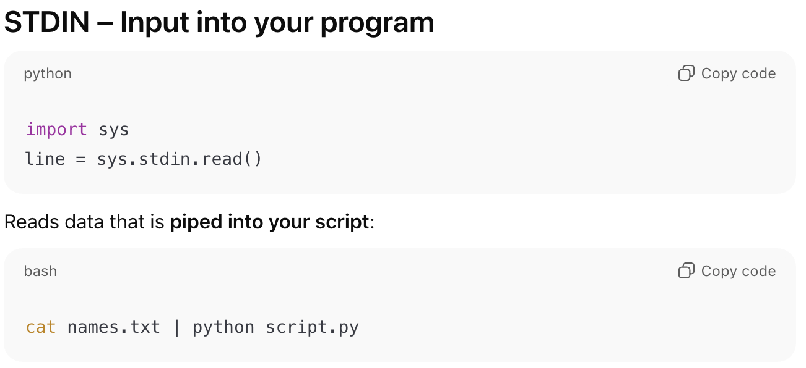
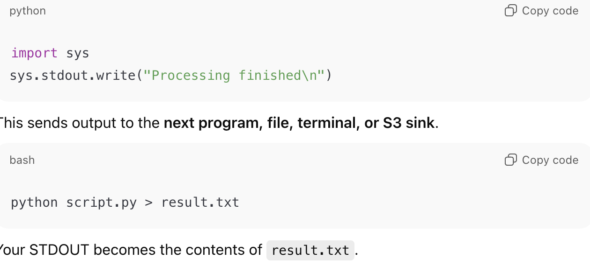
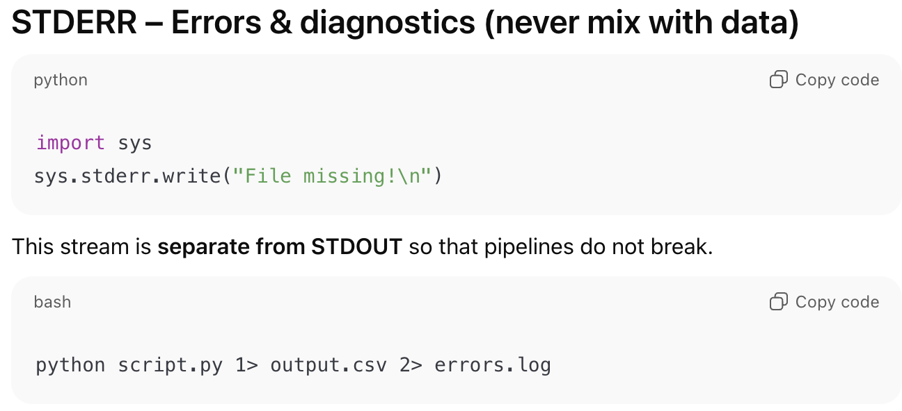

**Methods to read file**
* readlines() -- print out all the lines in the text
* readline() -- print out a single line one at a time
* To read/copy image (png, jpeg), use binary method: 'rb'(read binary) and 'wb'(write binary)

* Acronyms
    * r = Read
    * w = Write
    * a = Append
    * x = Create

* File handles
    STDIN  ──▶  YOUR PROGRAM  ──▶ STDOUT (DATA)
                            └──▶ STDERR (LOGS)
* STDIN

* STDOUT

* STDERR
